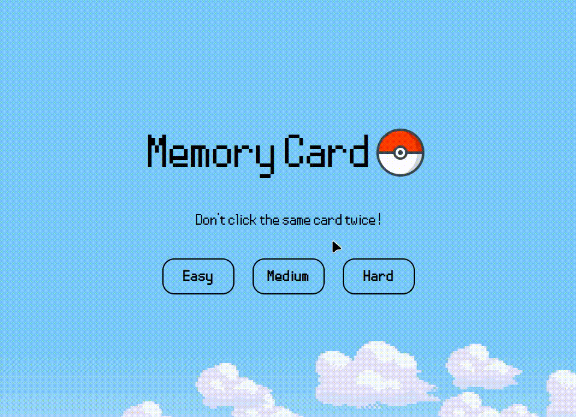

# Memory Card (Pokemon Cards)
This project was suggested by The Odin Project curriculum.
Made with React and vanilla CSS, for Pokemon cards PokeAPI was used.

The goal of the project was to get a better understanding of hooks in React, and their potential usage.

